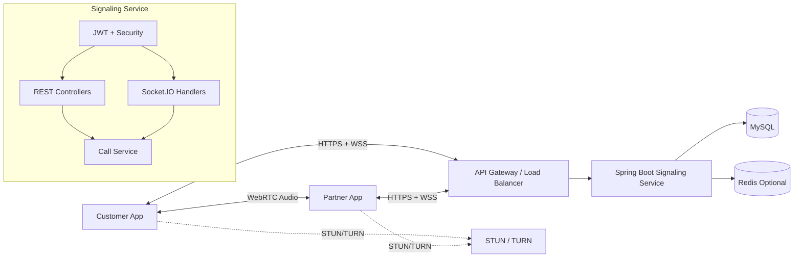

```mermaid
flowchart LR
    A[Customer App] <-->|HTTPS + WSS| LB[API Gateway / Load Balancer]
    B[Partner App] <-->|HTTPS + WSS| LB
    LB --> APP[Spring Boot Signaling Service]
    APP --> MYSQL[(MySQL)]
    APP --> REDIS[(Redis Optional)]
    A -. STUN/TURN .-> RTC[STUN / TURN]
    B -. STUN/TURN .-> RTC
    A <-->|WebRTC Audio| B

    subgraph APP_DETAIL[Signaling Service]
        REST[REST Controllers]
        SOCK[Socket.IO Handlers]
        SEC[JWT + Security]
        CALL[Call Service]
        REST --> CALL
        SOCK --> CALL
        SEC --> REST
        SEC --> SOCK
    end
```
